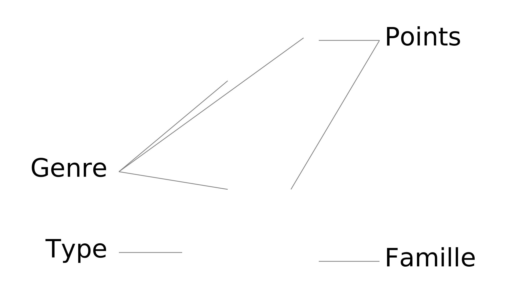
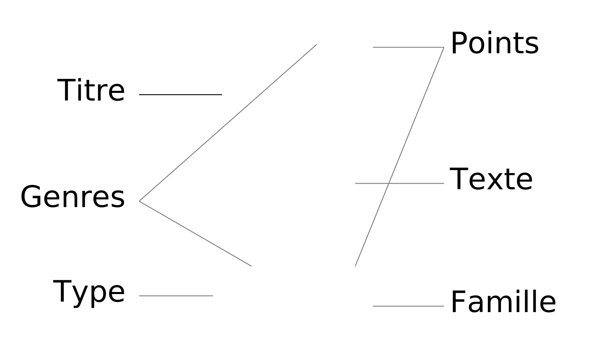

===========
 Artigiano
===========

Un jeu de Céline Dumas, avec la collaboration de Guillaume Ayoub.

Architecture, art, science : l’Europe connaît du XIV\ :sup:`ème` au XVI\
:sup:`ème` siècle un extraordinaire renouveau dans de nombreux domaines. Alors
que les châteaux-forts sont rendus obsolètes par les progrès de l’artillerie,
monarques et princes construisent de somptueux châteaux à travers le
continent. Saurez-vous rassembler les plus beaux matériaux et vous entourer des
meilleurs spécialistes pour construire le vôtre avant la fin de cette faste
époque qu’est la Renaissance ?

Matériel
========

Le jeu comprend :

- 4 jeux de 45 cartes, comprenant chacun :

  - 10 cartes « Matériau »,
  - 5 cartes « Action »,
  - 15 cartes « Action ou Matériau »,
  - 5 cartes « Spéciale »,
  - 5 cartes « Mission royale »,
  - 5 cartes « Mission princière » ;

- 4 plateaux de château ; et
- une règle du jeu.

But du jeu
==========

Le but du jeu est d’avoir le plus de points à l’issue de la partie.

Pour cela vous allez construire votre château à l’aide de matériaux posés sur
les cases de votre plateau. Des cartes spéciales vous donneront certains
avantages et vous permettront de ralentir la progression des autres joueurs. De
plus les missions qui vous auront été confiées, vous permettront certes de
gagner des points mais vous réserverons aussi quelques surprises.

Présentation générale
=====================

Disposition
-----------

Voici un exemple de disposition du jeu au cours d’une partie à 2 joueurs :

Cartes
------

Les cartes sont de différents types, chaque couleur de fond correspond à un
type particulier.

Action
~~~~~~

Matériau
~~~~~~~~

Action ou Matériau
~~~~~~~~~~~~~~~~~~

Spéciale
~~~~~~~~

Mission royale
~~~~~~~~~~~~~~

Mission princière
~~~~~~~~~~~~~~~~~

Dans cette règle du jeu et sur certaines cartes, on utilise des formules
raccourcies : on parle par exemple de « 2 actions » pour désigner deux cartes
de type « Action » ou « Action ou Matériau ». On parle également de « 1
pierre » pour désigner une carte dont le genre est « Pierre ».

Préparation
===========

Chaque joueur tire au sort un plateau qu’il place devant lui.

On choisit ensuite les familles de cartes que l’on utilisera pour la partie en
fonction du nombre de joueurs : 2 familles pour 2 joueurs, 3 familles pour 3
joueurs, 4 familles pour 4 joueurs. Les familles qui n’ont pas été choisies
sont écartées définitivement du jeu.

Chaque famille a ses particularités :

- la famille « armée » ``⚔`` est plutôt offensive ;
- la famille « clergé » ``✝`` est plutôt défensive ;
- la famille « artisans » ``⚒`` est plutôt consacrée à la qualité et à la
  protection des matériaux ;
- la famille « commerçants » ``⛀`` favorise l'interactivité entre les joueurs.

Les missions royales des familles choisies sont mélangées toutes ensemble ; on
en donne 2 à chaque joueur face cachée. On fait de même avec les missions
princières, mais on en distribue 3 par joueur. Les missions qui n'ont pas été
distribuées sont écartées définitivement du jeu.

Chaque joueur regarde ses missions et décide d’en garder 2 (au choix : 2
royales, 2 princières, 1 royale et 1 princière), qui correspondront aux
missions dites « obligatoires ». Les 3 autres missions sont dites
« facultatives ». Les deux tas (missions obligatoires et missions facultatives)
sont posés en haut du château, dans les zones qui leurs sont dédiées.

Les cartes restantes sont mélangées toutes ensemble et constituent la pioche.
On distribue à chaque joueur 5 cartes qu’il prend dans sa main.

Déroulement
===========

Le premier joueur est choisi au hasard. Les joueurs jouent à tour de rôle dans
le sens des aiguilles d’une montre. Chacun des tours de jeu comprend trois
phases :

- Phase 1 : Agir :

  - poser un matériau, ou
  - poser une action, ou
  - poser une carte spéciale, ou
  - jouer le stock, ou
  - défausser une carte ;

- Phase 2 : Stocker ;
- Phase 3 : Piocher.

Phase 1 : Agir
--------------

Lors de la première phase, le joueur doit effectuer une opération parmi :

- poser un matériau ; ou
- poser une action ; ou
- poser une carte spéciale ; ou
- jouer le stock ; ou
- défausser une carte.

Poser un matériau
~~~~~~~~~~~~~~~~~

Le joueur pose un matériau de sa main sur une case libre de son plateau.

Cette action doit suivre les règles de construction suivantes :

- le genre du matériau doit correspondre au genre indiqué sur la case ;
- la ou les cases sur lesquelles repose le matériau doivent être occupées.

Poser une action
~~~~~~~~~~~~~~~~

Le joueur pose une action de sa main sur la défausse. L’action indiquée sur la
carte est effectuée.

Poser une carte spéciale
~~~~~~~~~~~~~~~~~~~~~~~~

Le joueur pose une carte spéciale de sa main. Par défaut, elle doit être posée
dans la zone spéciale du joueur. Si le texte indique que la carte doit être
posée ailleurs (par exemple sur un matériau ou sur la zone spéciale d’un autre
joueur), il faut alors suivre ce qui est indiqué sur la carte.

Les cartes spéciales posées sur un matériau peuvent modifier son genre et sa
valeur. Par exemple, une carte spéciale ajoutant 2 à une pierre 4 la
transforme en une pierre 6. Dans certains cas, un matériau peut donc avoir une
valeur négative.

Jouer le stock
~~~~~~~~~~~~~~

Le joueur met de côté sa main actuelle et prend dans sa main l’ensemble des
cartes du stock. Dans l’ordre de son choix, il peut décider de jouer tout ou
partie de ses cartes (il doit en jouer au moins une). Selon le type de la
carte, reportez-vous à la section « poser un matériau », « poser une action »,
« poser une carte spéciale » ou « défausser une carte » décrites dans la
phase 1. Les cartes qui n’ont pas été jouées retournent dans le stock. Le
joueur reprend alors les cartes de sa main originale.

Défausser une carte
~~~~~~~~~~~~~~~~~~~

Le joueur défausse une carte de sa main. Cette carte n’a aucun effet.

Phase 2 : Stocker
-----------------

Le joueur peut poser une carte de sa main face cachée dans son stock si son
stock ne contient pas déjà trois cartes. Cette phase est optionnelle.

Phase 3 : Piocher
-----------------

Le joueur pioche le nombre de cartes nécessaires pour recouvrir 5 cartes dans
sa main.

À noter : dans certains cas exceptionnels, un joueur peut avoir plus de 5
cartes dans sa main.

Missions
========

Missions Princières
-------------------

À tout moment de la partie et si les conditions indiquées sont réunies, un
joueur peut retourner face visible une mission princière de sa pile de missions
obligatoires ou de missions facultatives. Cette mission est alors considérée
comme réussie.

Attention : 

- une mission princière qui n’a pas été retournée avant la fin de partie ne
  sera pas considérée comme accomplie même si ses conditions ont été réunies à
  un moment de la partie ;
- pour les missions qui impliquent d'avoir « au moins » ou « le plus » qu'un
  autre joueur, l'égalité n'est pas permise.

Missions Royales
----------------

Les missions royales sont retournées à la fin de la partie. Les missions
royales dont les conditions sont réunies sont considérées comme accomplies.

Fin de partie
=============

La fin de partie arrive au moment où l’une des conditions suivantes est
remplie :

- toutes les cases d’un château sont remplies ; ou
- un joueur doit piocher une carte mais la pioche est vide.

On décompte alors le nombre de points pour chaque joueur :

- 10 points si le joueur a rempli toutes les cases de son château ;
- la valeur des matériaux posés sur les cases (comprenant les points des cartes
  spéciales posées sur ces matériaux) ;
- les points des cartes spéciales posées dans sa zone spéciale ; et
- le nombre de points des missions réussies.

On retranche de ce total le nombre de points des missions
obligatoires non accomplies.

Le joueur avec le plus de points est déclaré vainqueur.

Précisions sur les cartes
=========================

Les cartes de type « Matériau » et « Action » sont dites « pures »,
contrairement aux cartes « Action ou Matériau » dites « composites ».

Les cartes « Action ou Matériau » sont à la fois de type « Action » et
« Matériau » lorsqu’ils sont dans la main, dans le stock, dans la pioche ou
dans la défausse. Cependant, lorsque ces cartes sont sur une case, elles
deviennent uniquement des matériaux durant le temps qu’elles restent sur le
plateau.

Par exemple, si vous devez compter le nombre de Matériaux dans votre main, les
cartes « Action ou Matériau » doivent être inclues dans ce compte.

Certaines cartes comportent deux ou trois genres de matériaux. Tout comme les
cartes qui ont plusieurs types, les matériaux sont des deux ou trois genres à
la fois lorsqu’elles sont dans la main, dans le stock, dans la pioche ou dans la
défausse. Cependant, lorsque ces matériaux sont sur une case, ils prennent
uniquement le genre de matériau indiqué sur la case sur laquelle ils sont.

De nombreuses cartes proposent « d'attaquer » un autre joueur. Cette action est
possible uniquement avec une carte action. Les cartes spéciales ne peuvent pas
dans ce cas « attaquer » un château ou un joueur.

Variante
========

Partie rapide
-------------

Pour jouer en partie rapide, vous n'avez pas besoin de plateau. Vous jouez avec
seulement 6 cases que vous imaginez devant vous comme suit : 

On ne joue qu’avec un jeu de cartes à 2 joueurs et avec 2 jeux à 3 ou 4
joueurs. On distribue 2 missions royales et 2 missions princières par joueur.
Chaque joueur choisit une mission obligatoire, les autres missions sont
écartées du jeu. Le stock est composé d’un emplacement par joueur. Le joueur qui
finit son château le premier marque 5 points.

Les autres règles restent inchangées. 

Remerciements
=============

Un grand merci à tous ceux qui ont essuyé les plâtres des premiers châteaux :
Arthur, Blandine, Amandine, Yann, Yohann, Chloé, Ronan, Anne, Chloé, Florent,
Nikro, Marion, Élodie, Pierre-Damien, Sidonie, Marianne, Laury, Julien.
